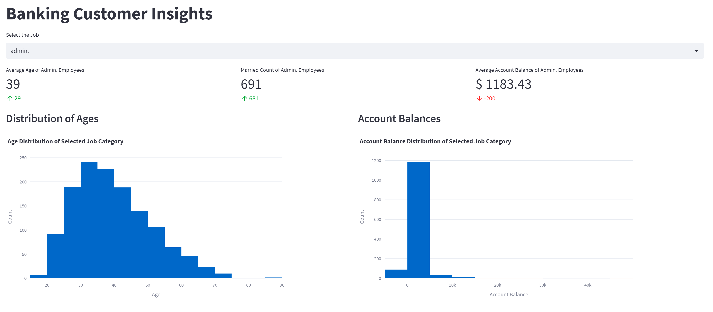

# Banking Customer Insights Dashboard

Banking Customer Insights Dashboard is a data web application that provides real-time insights into the demographics and account balances of bank customers based on their job categories. This interactive dashboard helps banking professionals to analyze customer data and make informed decisions. The application is built using Python and leverages libraries such as Pandas, Plotly, and Streamlit. The dashboard provides a range of features such as filtering based on job category, KPIs, histograms, and detailed data views.

Imagine you are a data analyst at a leading banking institution. Your job is to analyze customer data and provide insights that can improve customer experience and drive business growth. You spend hours working on complex data sets, and often the data changes rapidly, making it difficult to keep track of trends and changes over time. You wish you had a tool that could help you monitor the data in real-time and provide insights that are easy to understand and share with others. That's where this Banking Customer Insights Dashboard comes in. With this tool, you can monitor customer data in real-time, visualize key metrics, and identify trends and patterns that can help you make data-driven decisions.

---

Deployed Streamlit app:
https://bankingcustomers.streamlit.app/

---

## Getting Started
To get started, you need to have the following installed:

    Python 3
    Streamlit
    Pandas
    Numpy
    Plotly

---

## Installation

- Clone the repository

- Install the required libraries by running the following command in your terminal:
    
    pip install streamlit pandas numpy plotly

- Run the app by running the following command:

    streamlit run app.py

---

## Usage
Select the job category from the dropdown to filter the data.
The dashboard provides near real-time data simulation with changes in age and balance data.
The KPIs are displayed in a three-column layout with their respective metrics.
The charts display the distribution of ages and account balances.
The detailed data view displays the entire data set for the selected job category.

---

## High-level walkthrough:

**Import libraries:** The necessary Python libraries are imported to run the program. These include Pandas, Numpy, Plotly Express, and Streamlit.

**Load data:** The data is loaded into the program using the Pandas library. In this case, the data is read from a CSV file located in a Resources folder.

**Set page configuration:** The Streamlit function st.set_page_config() is used to set the title and layout of the dashboard.

**Create title and filters:** The title of the dashboard is set using the st.title() function, and a dropdown filter for the job category is created using the st.selectbox() function.

**Create container:** A container element is created using st.empty(), which is used to display the dashboard output.

**Filter data:** The data is filtered based on the selected job category using the Pandas function df[df['job']==job_filter].

**Simulate live data feed:** The for loop simulates live data by randomly generating new data based on the existing data in the data frame.

**Create KPIs:** Three key performance indicators (KPIs) are created based on the filtered data: average age of employees, count of married employees, and average account balance of employees. These KPIs are displayed using the st.metric() function.

**Create charts:** Two charts are created using Plotly Express: a histogram of age distribution and a histogram of account balance distribution. These charts are displayed using st.plotly_chart().

**Show detailed data view:** The data frame with the filtered data is displayed using st.dataframe().

**Allow user to control update frequency:** The time.sleep() function is used to control the update frequency of the simulated live data feed. The user can adjust the update frequency by changing the parameter of time.sleep().
